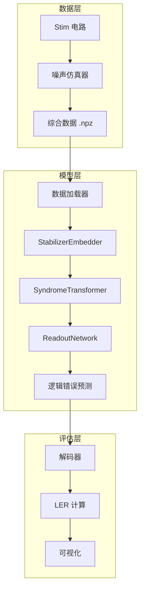

# AlphaQubit 开发者综合手册

> **版本**: 1.0  
> **最后更新**: 2024年12月  
> **目的**: 帮助开发者全面理解 AlphaQubit 项目的架构、模块功能、数据流和使用方法

---

## 📋 目录

1. [项目概述](#1-项目概述)
2. [系统架构](#2-系统架构)
3. [目录结构详解](#3-目录结构详解)
4. [核心模块功能](#4-核心模块功能)
5. [数据流与处理管道](#5-数据流与处理管道)
6. [配置文件说明](#6-配置文件说明)
7. [API 参考](#7-api-参考)
8. [常用脚本一览](#8-常用脚本一览)
9. [开发工作流程](#9-开发工作流程)
10. [故障排查指南](#10-故障排查指南)

---

## 1. 项目概述

### 1.1 什么是 AlphaQubit？

AlphaQubit 是一个基于深度学习的**量子纠错解码器**，复现了 Google 在 Nature 2024 发表的论文《Accurate neural network decoding of surface codes for quantum error correction》。

### 1.2 核心功能

| 功能 | 描述 |
|------|------|
| 🔬 **噪声仿真** | 支持 DEM、SI1000、Pauli+ 等多种噪声模型 |
| 🧠 **神经网络解码** | 基于 Transformer + MLA 的解码器架构 |
| 📊 **数据生成** | 自动生成训练/测试用的综合数据 |
| 🎯 **模型训练** | 支持预训练和微调流程 |
| 📈 **性能评估** | 计算逻辑错误率 (LER)、绘制性能曲线 |

### 1.3 论文对齐

本项目严格对齐 Google 论文中的：
- 表面码 (Surface Code) 仿真参数
- Pauli+ 噪声模型（含泄漏、串扰、软读出）
- 神经网络架构规格

---

## 2. 系统架构

### 2.1 整体架构图



### 2.2 模型架构详解

AlphaQubit 解码器由三个核心组件构成：

```
┌─────────────────────────────────────────────────────────────┐
│                    AlphaQubitDecoder                        │
├─────────────────────────────────────────────────────────────┤
│  ┌─────────────────────────────────────────────────────┐   │
│  │ 1. StabilizerEmbedder (稳定子嵌入器)                 │   │
│  │    - 特征投影: 每个通道独立线性变换                   │   │
│  │    - 位置编码: 稳定子索引嵌入                        │   │
│  │    - 最终轮标记: 区分最后测量轮                      │   │
│  └─────────────────────────────────────────────────────┘   │
│                            ↓                                │
│  ┌─────────────────────────────────────────────────────┐   │
│  │ 2. SyndromeTransformer (综合症Transformer)          │   │
│  │    - 多层 Transformer 堆叠                          │   │
│  │    - DeepSeek MLA 多头注意力机制                    │   │
│  │    - 前馈网络 (FFN) + 残差连接                      │   │
│  └─────────────────────────────────────────────────────┘   │
│                            ↓                                │
│  ┌─────────────────────────────────────────────────────┐   │
│  │ 3. ReadoutNetwork (读出网络)                        │   │
│  │    - 2D 卷积层处理空间特征                          │   │
│  │    - MLP 输出逻辑错误概率 (logit)                   │   │
│  └─────────────────────────────────────────────────────┘   │
└─────────────────────────────────────────────────────────────┘
```

### 2.3 输入输出规格

| 项目 | 形状 | 说明 |
|------|------|------|
| **输入** | `(N, R, S, 3)` | N=批量, R=轮数, S=稳定子数, 3=特征通道 |
| **特征通道0** | - | 离散检测事件比特 (0/1) |
| **特征通道1** | - | 计算态后验概率 (soft readout) |
| **特征通道2** | - | 泄漏态后验概率 |
| **输出** | `(N, 1)` | 逻辑错误对数几率 (logit) |

---

## 3. 目录结构详解

```plaintext
ALPHAQUBIT/
│
├── 📁 ai_models/                 # 🧠 AI 模型核心代码
│   ├── model.py                  # 标准 Transformer 解码器
│   ├── model_mla.py              # MLA (多头潜在注意力) 解码器
│   ├── train.py                  # 统一训练入口
│   ├── decode.py                 # 推理/解码脚本
│   ├── fine_tune.py              # 单实验微调
│   ├── fine_tune_npz.py          # 基于 .npz 的微调
│   └── pauli_plus_dataset.py     # Pauli+ 数据集类
│
├── 📁 configs/                   # ⚙️ 配置文件
│   ├── dem.yaml                  # 检测误差模型配置
│   ├── si1000.yaml               # SI1000 噪声配置
│   ├── pauli_plus.yaml           # Pauli+ 噪声配置
│   └── paper_aligned.yaml        # 论文对齐配置
│
├── 📁 google_qec_simulator/      # 🔬 Google QEC 仿真器
│   ├── main.py                   # 主入口：生成软通道数据
│   ├── circuit_utils.py          # Stim 电路工具
│   ├── data_helpers.py           # 数据辅助函数
│   ├── data_manager.py           # 数据管理器
│   ├── experiment_simulator.py   # 实验仿真器
│   └── stim_helpers.py           # Stim 辅助函数
│
├── 📁 simulator/                 # 📊 噪声仿真器集合
│   ├── dem_generator.py          # DEM 噪声生成器
│   ├── si1000_generator.py       # SI1000 噪声生成器
│   ├── pauli_plus_simulator.py   # Pauli+ 仿真器
│   └── paper_aligned_adapter.py  # 论文对齐适配器
│
├── 📁 my_noise_model/            # 🎲 自定义噪声模型
│   ├── circuit_builder.py        # Pauli+ 电路构建器
│   ├── iq_readout.py             # I/Q 软读出模型
│   ├── si1000.py                 # SI1000 权重生成
│   ├── softxor.py                # 软 XOR 实现
│   ├── gpta.py                   # 广义 Pauli 托恩
│   ├── pauli_plus.py             # Pauli+ 通道构建
│   └── kraus_utils.py            # Kraus 算符工具
│
├── 📁 mla/                       # 🔄 MLA 注意力机制
│   ├── core.py                   # DeepSeekMLA 核心实现
│   ├── projection.py             # 投影系统
│   ├── attention.py              # 安全注意力计算
│   └── rotary.py                 # 旋转位置编码
│
├── 📁 paper_figures/             # 📈 论文图表生成
│   ├── generate_all.py           # 一键生成所有图表
│   ├── fig2_threshold_plot.py    # 图2：阈值曲线
│   ├── fig3_decoder_comparison.py# 图3：解码器对比
│   ├── fig4_finetuning_results.py# 图4：微调结果
│   └── paper_data.py             # 论文参考数据
│
├── 📁 verification/              # ✅ 验证工具
│   └── verify_paper_alignment.py # 论文对齐验证
│
├── 📁 pretrain_data/             # 📦 预训练数据存放
├── 📁 simulated_data/            # 📦 仿真数据存放
├── 📁 output/                    # 📤 输出结果
├── 📁 finetuned_models/          # 💾 微调后模型
│
├── 🔧 generate_data.py           # 数据生成主脚本
├── 🔧 make_all_pretraining_noise.py  # 批量预训练数据生成
├── 🔧 run_training_all.py        # 批量训练脚本
├── 🔧 run_finetune_all.py        # 批量微调脚本
├── 🔧 run_decode_all.py          # 批量解码脚本
├── 🔧 run_create_all_samples.py  # 批量样本生成
├── 🔧 plot_alphaquibit_results.py# 结果可视化
├── 🔧 npy_viewer.py              # .npy 数据查看器
│
└── 📄 README.md                  # 项目说明
```

---

## 4. 核心模块功能

### 4.1 AI 模型模块 (`ai_models/`)

#### `model_mla.py` - MLA 解码器（推荐）

```python
# 核心类
class StabilizerEmbedder(nn.Module):
    """稳定子特征嵌入器
    - 将原始检测事件转换为隐藏表示
    - 包含位置编码和最终轮标记
    """

class SyndromeTransformer(nn.Module):
    """综合症 Transformer
    - 使用 DeepSeek MLA 注意力机制
    - 多层堆叠提取时空特征
    """

class AlphaQubitDecoder(nn.Module):
    """完整解码器
    - 默认参数: hidden_dim=256, num_layers=12, num_heads=8
    - 参数量: ~8.2M (d=5 表面码)
    """
```

#### `train.py` - 统一训练入口

```python
# 用法示例
python ai_models/train.py --config configs/dem.yaml

# 支持的配置覆盖
--samples 10000      # 样本数
--epochs 100         # 训练轮数
--batch-size 128     # 批量大小
--lr 1e-4            # 学习率
--model-path ./my_model.pth  # 输出路径
```

#### `decode.py` - 推理解码

```python
# 用法示例
python ai_models/decode.py \
    --model alphaqubit.pth \
    --data output/syndromes.npz \
    --output results/metrics.json
```

#### `fine_tune.py` - 实验微调

```python
# 用法示例
python ai_models/fine_tune.py \
    --dataset path/to/experiment \
    --model_path pretrained.pth \
    --epochs 30 \
    --mla  # 使用 MLA 架构
```

### 4.2 噪声仿真模块 (`simulator/`)

| 文件 | 功能 | 噪声类型 |
|------|------|----------|
| `dem_generator.py` | 检测误差模型 | Clifford 去极化 + 重置翻转 |
| `si1000_generator.py` | SI1000 噪声 | 电路级去极化噪声 |
| `pauli_plus_simulator.py` | Pauli+ 仿真 | 泄漏 + 串扰 + 软读出 |
| `paper_aligned_adapter.py` | 论文对齐 | 完整论文噪声模型 |

### 4.3 Google QEC 仿真器 (`google_qec_simulator/`)

```python
# 主要功能
- 读取 .stim 电路文件
- 执行蒙特卡洛采样
- 生成软通道数据 (I/Q 读出)
- 输出 .npz 格式数据包

# 用法
python -m google_qec_simulator.main <exp_folder> --shots 2000
```

### 4.4 自定义噪声模型 (`my_noise_model/`)

#### 关键组件

| 文件 | 功能 |
|------|------|
| `circuit_builder.py` | 构建带噪声的 Stim 电路 |
| `iq_readout.py` | I/Q 软读出模型（计算后验概率） |
| `gpta.py` | 广义 Pauli 托恩 (GPT) |
| `softxor.py` | 软 XOR: `p + q - 2pq` |
| `si1000.py` | SI1000 噪声权重 |
| `pauli_plus.py` | Pauli+ 通道构建 |

#### 稳定子测量实现

```python
# 位置: circuit_builder.py, 行 437-469

# 6 个稳定子的测量:
# Z 型 (3个): S1, S2, S3 - 使用 CNOT 从数据到辅助
# X 型 (3个): S4, S5, S6 - 使用 CNOT 从辅助到数据
```

### 4.5 MLA 注意力模块 (`mla/`)

```python
# DeepSeekMLA 实现
class DeepSeekMLA(nn.Module):
    """多头潜在注意力机制
    
    特点:
    - 压缩 KV 缓存
    - 旋转位置编码 (RoPE)
    - 安全注意力计算
    """
```

---

## 5. 数据流与处理管道

### 5.1 完整数据流

```
┌──────────────────────────────────────────────────────────────────────┐
│                         数据生成阶段                                  │
├──────────────────────────────────────────────────────────────────────┤
│  Stim 电路 (.stim)                                                   │
│       ↓                                                              │
│  噪声注入 (DEM/SI1000/Pauli+)                                        │
│       ↓                                                              │
│  蒙特卡洛采样                                                         │
│       ↓                                                              │
│  检测事件 + 软通道                                                    │
│       ↓                                                              │
│  .npz 数据包 (data, obs, soft_ch1, soft_ch2)                         │
└──────────────────────────────────────────────────────────────────────┘
                                  ↓
┌──────────────────────────────────────────────────────────────────────┐
│                         训练阶段                                      │
├──────────────────────────────────────────────────────────────────────┤
│  PauliPlusDataset 加载                                               │
│       ↓                                                              │
│  数据预处理 (reshape, normalize)                                     │
│       ↓                                                              │
│  DataLoader 批量迭代                                                 │
│       ↓                                                              │
│  AlphaQubitDecoder 前向传播                                          │
│       ↓                                                              │
│  BCEWithLogitsLoss 计算                                              │
│       ↓                                                              │
│  反向传播 + Adam 优化                                                │
│       ↓                                                              │
│  保存 .pth 权重                                                      │
└──────────────────────────────────────────────────────────────────────┘
                                  ↓
┌──────────────────────────────────────────────────────────────────────┐
│                         推理/评估阶段                                 │
├──────────────────────────────────────────────────────────────────────┤
│  加载测试数据                                                        │
│       ↓                                                              │
│  模型推理 (logits → sigmoid → 概率)                                  │
│       ↓                                                              │
│  阈值判决 (p > 0.5 → 逻辑错误)                                       │
│       ↓                                                              │
│  计算 LER (Logical Error Rate)                                       │
│       ↓                                                              │
│  输出 metrics.json + 可视化                                          │
└──────────────────────────────────────────────────────────────────────┘
```

### 5.2 数据格式说明

#### `.npz` 文件结构

```python
# 标准字段
data['data']       # shape: (N, R, S, F) - 主特征张量
data['obs']        # shape: (N,) 或 (N, K) - 逻辑观测量标签
data['basis']      # 可选: 测量基 (0=X, 1=Z)

# 软通道 (可选)
data['soft_ch1']   # shape: (N, R, S) - 计算态后验
data['soft_ch2']   # shape: (N, R, S) - 泄漏态后验
```

#### 配置 YAML 结构

```yaml
# 电路参数
circuit_params:
  code_task: "surface_code:rotated_memory_z"
  distance: 3
  rounds: 25

# 噪声参数
error_rates:
  after_clifford_depolarization: 0.01
  after_reset_flip_probability: 0.005

# 训练参数 (可选)
training:
  epochs: 100
  batch_size: 128
  learning_rate: 1e-4
```

---

## 6. 配置文件说明

### 6.1 噪声模型配置

| 配置文件 | 噪声类型 | 适用场景 |
|----------|----------|----------|
| `dem.yaml` | 检测误差模型 | 快速测试、基准评估 |
| `si1000.yaml` | SI1000 电路噪声 | 更真实的电路级噪声 |
| `pauli_plus.yaml` | Pauli+ 完整噪声 | 包含泄漏、串扰 |
| `paper_aligned.yaml` | 论文对齐 | 复现论文结果 |

### 6.2 配置参数详解

```yaml
# dem.yaml 详解
circuit_params:
  code_task: "surface_code:rotated_memory_z"  # Stim 电路类型
  distance: 3          # 码距 (d=3,5,7,...)
  rounds: 25           # QEC 测量轮数

error_rates:
  after_clifford_depolarization: 0.01   # Clifford 门后去极化概率
  after_reset_flip_probability: 0.005   # 重置操作翻转概率
```

---

## 7. API 参考

### 7.1 模型 API

```python
from ai_models.model_mla import AlphaQubitDecoder

# 创建模型
model = AlphaQubitDecoder(
    hidden_dim=256,       # 隐藏层维度
    num_layers=12,        # Transformer 层数
    num_heads=8,          # 注意力头数
    num_stabilizers=24,   # 稳定子数量
    num_features=3,       # 输入特征通道
    grid_size=5           # 表面码网格大小
)

# 前向传播
logits = model(x, final_mask)  # x: (B, S, F)

# 计算概率
probs = torch.sigmoid(logits)
```

### 7.2 数据集 API

```python
from ai_models.pauli_plus_dataset import PauliPlusDataset

# 创建数据集
dataset = PauliPlusDataset(
    npz_file='data/samples.npz',
    basis_id=0  # 0=X基, 1=Z基
)

# 使用 DataLoader
loader = DataLoader(dataset, batch_size=128, shuffle=True)

for batch in loader:
    x, y, mask = batch
    # x: 输入特征
    # y: 标签
    # mask: 最终轮掩码
```

### 7.3 噪声生成 API

```python
from simulator.dem_generator import generate_dem_data
from simulator.si1000_generator import si1000_noise_model

# DEM 数据生成
syndromes, labels = generate_dem_data(
    num_samples=10000,
    dem_config=config_dict
)

# SI1000 噪声生成
circuit = si1000_noise_model(
    distance=5,
    rounds=10,
    p_phys=0.01
)
```

---

## 8. 常用脚本一览

### 8.1 数据生成脚本

| 脚本 | 功能 | 示例命令 |
|------|------|----------|
| `generate_data.py` | 生成单类型噪声数据 | `python generate_data.py --model dem --samples 10000` |
| `make_all_pretraining_noise.py` | 批量生成预训练数据 | `python make_all_pretraining_noise.py --out-dir pretrain_data` |
| `run_create_all_samples.py` | 批量生成实验样本 | `python run_create_all_samples.py --shots 2000` |

### 8.2 训练脚本

| 脚本 | 功能 | 示例命令 |
|------|------|----------|
| `ai_models/train.py` | 单配置训练 | `python ai_models/train.py --config configs/dem.yaml` |
| `run_training_all.py` | 批量训练 | `python run_training_all.py --epochs 50` |
| `run_finetune_all.py` | 批量微调 | `python run_finetune_all.py` |

### 8.3 评估脚本

| 脚本 | 功能 | 示例命令 |
|------|------|----------|
| `ai_models/decode.py` | 单文件解码 | `python ai_models/decode.py --model model.pth --data data.npz` |
| `run_decode_all.py` | 批量解码 | `python run_decode_all.py --model finetuned_models/` |
| `plot_alphaquibit_results.py` | 结果可视化 | `python plot_alphaquibit_results.py` |

### 8.4 验证脚本

| 脚本 | 功能 | 示例命令 |
|------|------|----------|
| `verify_6_stabilizers.py` | 验证稳定子实现 | `python verify_6_stabilizers.py` |
| `verification/verify_paper_alignment.py` | 论文对齐验证 | `python -m verification.verify_paper_alignment` |
| `comprehensive_diagnosis.py` | 全面诊断 | `python comprehensive_diagnosis.py` |

---

## 9. 开发工作流程

### 9.1 标准开发流程

```
1. 生成数据
   ├── 快速测试: python generate_data.py --model dem --samples 1000
   └── 完整训练: python make_all_pretraining_noise.py

2. 训练模型
   ├── 单模型: python ai_models/train.py --config configs/dem.yaml
   └── 批量: python run_training_all.py

3. 微调模型 (可选)
   └── python run_finetune_all.py

4. 评估解码
   ├── 单文件: python ai_models/decode.py --model model.pth --data test.npz
   └── 批量: python run_decode_all.py

5. 可视化结果
   └── python plot_alphaquibit_results.py
```

### 9.2 快速冒烟测试

```bash
# 本地 CPU 快速测试 (约 5 分钟)
python run_training_all.py --epochs 1 --batch-size 32 --max-samples 1024
```

### 9.3 NPU/GPU 加速

```bash
# 自动检测并使用华为 Ascend NPU
python run_training_all.py --npu

# 指定设备
python -m google_qec_simulator.main exp_folder --device npu
python -m google_qec_simulator.main exp_folder --device cuda
```

---

## 10. 故障排查指南

### 10.1 常见问题

| 问题 | 原因 | 解决方案 |
|------|------|----------|
| `ModuleNotFoundError: leakysim` | 缺少 leakysim 包 | `pip install leakysim>=0.4.0` 或使用内置 stub |
| `FileNotFoundError: *.stim` | 实验数据路径错误 | 检查 `experiment_data/` 路径 |
| `CUDA out of memory` | 批量大小过大 | 减小 `--batch-size` |
| `LER 过高` | 训练不足/数据不匹配 | 增加 epochs, 检查数据对齐 |

### 10.2 诊断工具

```bash
# 全面诊断
python comprehensive_diagnosis.py

# 代码正确性检查
python diagnose_code_issues.py

# 论文对齐验证
python -m verification.verify_paper_alignment
```

### 10.3 日志文件

- `pipeline_log.txt`: 流水线执行日志
- `pipeline_results.json`: 运行结果摘要
- `results/*.json`: 解码指标文件

---

## 附录 A: 术语表

| 术语 | 英文 | 说明 |
|------|------|------|
| 稳定子 | Stabilizer | 用于检测错误的量子算符 |
| 表面码 | Surface Code | 一种二维拓扑量子纠错码 |
| LER | Logical Error Rate | 逻辑错误率 |
| MLA | Multi-head Latent Attention | 多头潜在注意力 |
| DEM | Detection Error Model | 检测误差模型 |
| I/Q 读出 | I/Q Readout | 量子比特的软测量方式 |
| 托恩 | Twirl | 噪声通道的 Pauli 近似 |

---

## 附录 B: 相关文档

- [README.md](README.md) - 项目快速入门
- [WORKFLOW_GUIDE.md](WORKFLOW_GUIDE.md) - 完整工作流程
- [CODE_LOCATION_GUIDE.md](CODE_LOCATION_GUIDE.md) - 代码位置参考
- [PAPER_ALIGNMENT_SPEC.md](PAPER_ALIGNMENT_SPEC.md) - 论文对齐规格
- [FINETUNING_GUIDE.md](FINETUNING_GUIDE.md) - 微调指南

---

> **维护者**: AlphaQubit 团队  
> **反馈**: 如有问题或建议，请提交 Issue
