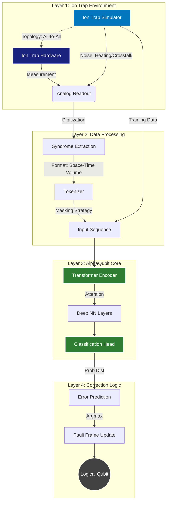

```mermaid
graph TD
    %% 样式定义
    classDef hardware fill:#1a237e,stroke:#fff,stroke-width:2px,color:#fff
    classDef simulator fill:#0277bd,stroke:#fff,stroke-width:1px,color:#fff
    classDef ai fill:#2e7d32,stroke:#fff,stroke-width:2px,color:#fff
    classDef logic fill:#424242,stroke:#fff,stroke-width:1px,color:#fff

    %% Layer 1
    subgraph L1 [Layer 1: Ion Trap Environment]
        direction TB
        A[Ion Trap Hardware]:::hardware -->|Measurement| B(Analog Readout)
        Sim[Ion Trap Simulator]:::simulator -->|Noise: Heating/Crosstalk| B
        Sim -.->|Topology: All-to-All| A
    end

    %% Layer 2
    subgraph L2 [Layer 2: Data Processing]
        B -->|Digitization| C[Syndrome Extraction]
        C -->|Format: Space-Time Volume| D[Tokenizer]
        D -->|Masking Strategy| E[Input Sequence]
    end

    %% Layer 3
    subgraph L3 [Layer 3: AlphaQubit Core]
        E --> F[Transformer Encoder]:::ai
        F -->|Attention| G[Deep NN Layers]
        G --> H[Classification Head]:::ai
    end

    %% Layer 4
    subgraph L4 [Layer 4: Correction Logic]
        H -->|Prob Dist| I[Error Prediction]
        I -->|Argmax| J[Pauli Frame Update]
        J --> K((Logical Qubit)):::logic
    end

    %% 跨层连接
    Sim -->|Training Data| E
```